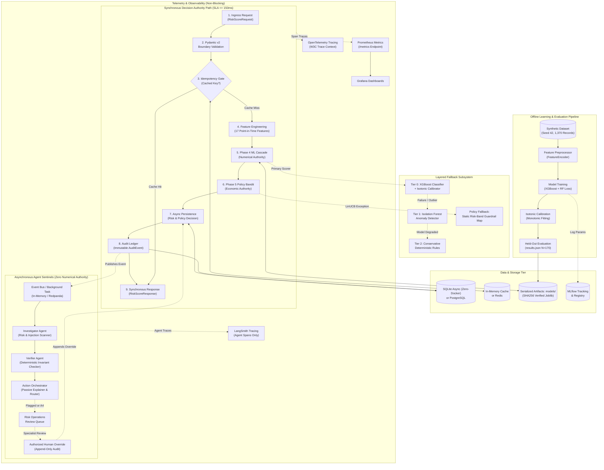

# System Architecture & Topology

**Status:** Authoritative Production Implementation  
**Project:** AI Risk Manager: Real-Time Return-Risk Scorer & Intervention Sentinel  
**Compliance Standard:** Buildathon Excellence & Evidence Specification  

---

## 1. System Topology & Path Isolation

The diagram below details the end-to-end topology of the AI Risk Manager.

> **The center path is the synchronous decision authority; side branches provide fallbacks, persistence, offline learning, streaming, agent investigation, and observability without being allowed to alter the authoritative decision.**

---

## 2. Invariant Boundary Definitions

### Synchronous Critical Path
The synchronous risk decision path executes in $\le 150\text{ ms}$ (P95 target). It contains exactly nine sequential steps:
1. Ingress request validation (`RiskScoreRequest`).
2. Idempotency deduplication check (`idempotency_key`).
3. Point-in-time feature engineering (17 deterministic features).
4. **Phase 4 ML Cascade Scoring:** Sole numerical authority for $p_{\text{return\_abuse}}$, `risk_band`, `scoring_source`, and `fallback_tier`.
5. **Phase 5 Economic & Policy Engine:** Sole authority for expected loss, net value, candidate action eligibility, and selected action.
6. Asynchronous database transaction persistence.
7. Append-only audit ledger entry (`AuditEvent`).
8. Synchronous response formatting (`RiskScoreResponse`).

No generative AI model, agentic workflow, external telemetry exporter, or human review blocks this synchronous pipeline.

### Asynchronous Multi-Agent Sentinel Path
Once the decision is committed, domain events trigger the Phase 6 LangGraph agent sentinel asynchronously:
- **Investigator:** Performs text feature extraction, checks return claim plausibility, scans for adversarial prompt injection, and flags contradictions.
- **Verifier:** Evaluates 10 deterministic invariants (risk band consistency, action validity, eligibility guardrails, economic non-negativity). If any deterministic check fails, verification **fails definitively**; no LLM output can override a deterministic failure.
- **Action Orchestrator:** Formulates plain-language risk explanations and routes flagged or critical cases to human review.
- **Strict Boundary:** Agents possess **zero numerical authority**. They can never alter $p_{\text{return\_abuse}}$, change the selected policy action, or mutate historical records.

### Human Review & Override Exclusivity
- An authorized human operator in the Risk Operations console is the **only** entity permitted to alter an effective policy action.
- Overrides follow append-only semantics: the original algorithmic decision is **never deleted or mutated**. A new `PolicyDecision` row is appended with `selected_by=MANUAL_OVERRIDE`, linked to an immutable `AuditEvent` recording operator ID, timestamp, and justification.

### Pure In-Memory What-If Counterfactual Sandbox
- The counterfactual simulation endpoint (`POST /api/v1/demo/simulate`) executes the real Phase 4 cascade and Phase 5 policy bandit.
- Simulations run **entirely in memory**, creating 0 database rows, 0 audit events, and 0 production state alterations.
