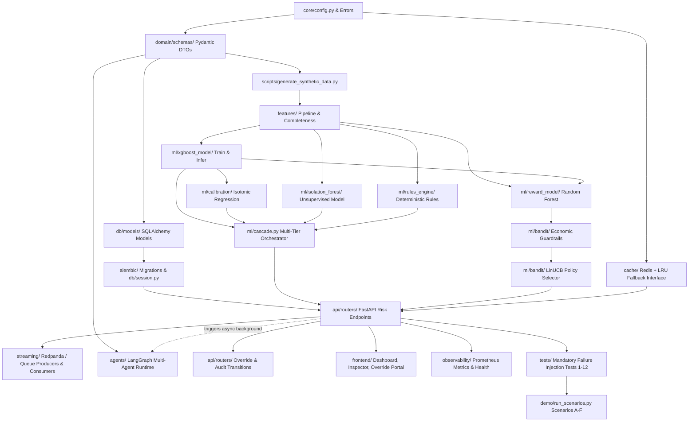

# IMPLEMENTATION_AUDIT.md — Repository & Architecture Audit

**Audit Date:** 2026-09-04  
**Audit Author:** Lead Implementation Engineer  
**Audit Objective:** Comprehensive repository, architectural, infrastructure, and feasibility audit across all system documentation (`SPEC.md`, `ARCHITECTURE.md`, `ROADMAP.md`, `STATE.md`, `PLAN.md`, `SUMMARY.md`, `PRD.md`, `TRD.md`) against current workspace state and local runtime environment.

---

## 1. Current Repository State & Status Classification

### 1.1 Filesystem & Version Control Inspection
- **Git Status:** No `.git` directory exists (`fatal: not a git repository`). The directory is an uninitialized workspace.
- **Source Code:** Zero application code, zero scripts, zero test files.
- **Configuration & Dependencies:** No `pyproject.toml`, `requirements.txt`, `setup.py`, or `.env` files.
- **Database & Migrations:** No migrations (`alembic/`), no database schemas, no SQLite/PostgreSQL files.
- **Infrastructure:** No `docker-compose.yml`, Dockerfiles, or Kubernetes manifests.
- **Frontend:** No HTML, CSS, or JavaScript assets.
- **Documentation:** The workspace contains strictly eight markdown specification documents:
  - [SPEC.md](file:///c:/Users/Tanishq%20Sutrave/Documents/AI-Risk-Manager/SPEC.md) (18,110 bytes)
  - [ARCHITECTURE.md](file:///c:/Users/Tanishq%20Sutrave/Documents/AI-Risk-Manager/ARCHITECTURE.md) (14,696 bytes)
  - [ROADMAP.md](file:///c:/Users/Tanishq%20Sutrave/Documents/AI-Risk-Manager/ROADMAP.md) (17,220 bytes)
  - [STATE.md](file:///c:/Users/Tanishq%20Sutrave/Documents/AI-Risk-Manager/STATE.md) (17,985 bytes)
  - [PLAN.md](file:///c:/Users/Tanishq%20Sutrave/Documents/AI-Risk-Manager/PLAN.md) (33,514 bytes)
  - [SUMMARY.md](file:///c:/Users/Tanishq%20Sutrave/Documents/AI-Risk-Manager/SUMMARY.md) (6,185 bytes)
  - [PRD.md](file:///c:/Users/Tanishq%20Sutrave/Documents/AI-Risk-Manager/PRD.md) (12,143 bytes)
  - [TRD.md](file:///c:/Users/Tanishq%20Sutrave/Documents/AI-Risk-Manager/TRD.md) (27,414 bytes)

### 1.2 Status Classification Matrix

| Component / Subsystem | Status | Details |
|---|---|---|
| **System Documentation Set** | **IMPLEMENTED** | All 8 specification documents exist, authored with high detail. |
| **Project Skeleton & Packaging** | **NOT IMPLEMENTED** | No Python package layout (`risk_manager/`), no virtualenv, no package configs. |
| **Infrastructure Orchestration** | **PLANNED** | Docker Compose for Postgres, Redis, Redpanda planned in ROADMAP Phase 1 / PLAN T-INFRA-01. |
| **Domain Schemas & Pydantic DTOs** | **PLANNED** | Fully specified in TRD.md §E/M; 0 lines of code written. |
| **PostgreSQL Database & Alembic** | **PLANNED** | 10 entities specified in TRD.md §C/D; no DB running, 0 migrations written. |
| **Event Streaming (Redpanda)** | **PLANNED** | 6 topics and envelope specified in TRD.md §F; no broker or client code. |
| **Feature Engineering Pipeline** | **PLANNED** | 17 features specified in TRD.md §H; no code written. |
| **Synthetic Dataset Generator** | **NOT IMPLEMENTED** | Required for training Tier 0, Tier 1, and Reward Model; no generator script exists. |
| **Tier 0 Model (XGBoost + Isotonic)**| **PLANNED** | Training, calibration, and inference routines specified; no models trained. |
| **Tier 1 Fallback (Isolation Forest)**| **PLANNED** | Unsupervised anomaly fallback specified; no model trained. |
| **Tier 2 Fallback (Rules Engine)** | **PLANNED** | Heuristic fallback rules specified; no rules code written. |
| **Fallback Cascade Orchestrator** | **PLANNED** | Circuit breaker and trigger hierarchy specified; no code written. |
| **Reward Model (Random Forest)** | **PLANNED** | Economic regressor specified; no model trained. |
| **Policy Engine (LinUCB + Guardrails)**| **PLANNED** | Contextual bandit and economic guardrail specified; no code written. |
| **Cache Layer (Redis + LRU)** | **PLANNED** | Redis client and LRU fallback specified; no code written. |
| **FastAPI Service Boundary** | **PLANNED** | 6 endpoints specified in TRD.md §L; no application code. |
| **LangGraph Agentic Subsystem** | **PLANNED** | 3 agents (Investigator, Verifier, Orchestrator) specified; no code written. |
| **Audit & Manual Override System** | **PLANNED** | Append-only state transition logic specified; no code written. |
| **Observability (Prometheus/Grafana)**| **PLANNED** | 18 metrics specified in TRD.md §P; no instrumentation. |
| **Frontend Dashboard & Inspector** | **PLANNED** | HTML5/vanilla JS mockups specified; no frontend assets. |
| **Test Suite & Failure Injection** | **PLANNED** | 12 mandatory failure-injection tests specified; no test files. |
| **Demo Scenario Harness (A–F)** | **PLANNED** | Scenarios A–F specified; no runner script. |

---

## 2. Target Architecture Overview

The system is designed as a **dual-path, defensive-only return risk decisioning engine**:

```
                              [ Incoming Return Request / Event ]
                                               │
                                 ┌─────────────┴─────────────┐
                                 ▼                           ▼
                     [ POST /v1/risk/score ]       [ return.events.v1 ]
                                 │                           │
                                 └─────────────┬─────────────┘
                                               │
                                               ▼
                              ┌──────────────────────────────────┐
                              │  FastAPI Validation & Idempotency│
                              └────────────────┬─────────────────┘
                                               │
                                               ▼
                                  ┌───────────────────────────┐
                                  │ Cache Lookup (Redis / LRU)│
                                  └────────────┬──────────────┘
                                    hit ┌──────┴──────┐ miss
                                        │             │
                                        │             ▼
                                        │   ┌─────────────────────────┐
                                        │   │   Feature Retrieval     │
                                        │   │   (Decision-time DB)    │
                                        │   └─────────┬───────────────┘
                                        │             │
                                        │             ▼
                                        │   ┌─────────────────────────┐
                                        │   │    ML Cascade Scorer    │
                                        │   │ ─────────────────────── │
                                        │   │ Tier 0: XGBoost+Isotonic│
                                        │   │ Tier 1: Isolation Forest│
                                        │   │ Tier 2: Rules Engine    │
                                        │   └─────────┬───────────────┘
                                        │             │ p_return_abuse
                                        │             ▼
                                        │   ┌─────────────────────────┐
                                        │   │  RF Reward Model &      │
                                        │   │  Economic Guardrails    │
                                        │   └─────────┬───────────────┘
                                        │             │ ExpectedNetValue
                                        │             ▼
                                        │   ┌─────────────────────────┐
                                        │   │ LinUCB Policy Selector  │
                                        │   │ (Merchant Allowed A0-A4)│
                                        │   └─────────┬───────────────┘
                                        │             │
                                        │             ▼
                                        │   ┌─────────────────────────┐
                                        │   │ Persistence & Cache SET │
                                        │   │ (PostgreSQL & Redis/LRU)│
                                        │   └─────────┬───────────────┘
                                        │             │
                                        ▼             ▼
                              ┌───────────────────────────────────┐
                              │     HTTP Response (≤ 150ms p95)   │
                              └─────────────────┬─────────────────┘
                                                │
                                                ▼ (non-blocking async background)
                                ┌───────────────────────────────────┐
                                │     LangGraph Agent Enrichment    │
                                │  Investigator ➔ Verifier ➔ Orch   │
                                │   (Gemini Structured Output)      │
                                └─────────────────┬─────────────────┘
                                                  │
                                                  ▼
                                ┌───────────────────────────────────┐
                                │ Append-Only Audit & DB Enrichment │
                                └───────────────────────────────────┘
```

### Architectural Principles Enforced by Design:
1. **Defensive-Only Guarantee:** The system predicts risk and estimates economic value to choose the least harmful intervention. It does not generate fraud evasion vectors or profile protected classes.
2. **Numeric Truth Isolation:** Large Language Models (Gemini via LangGraph) are strictly barred from inventing or altering numerical risk scores (`p_return_abuse`) or economic metrics (`expected_loss`, `expected_net_value`). All numeric truth derives deterministically from ML models and explicit formulas.
3. **Graceful Degradation (Fallback Cascade):** If the primary model fails, times out (>100ms), or has missing features, scoring automatically degrades:
   $$\text{Tier 0 (XGBoost + Isotonic)} \longrightarrow \text{Tier 1 (Isolation Forest)} \longrightarrow \text{Tier 2 (Rules Engine)}$$
4. **Append-Only Immutability:** Manual overrides never mutate or delete historical decisions; they insert a new `policy_decisions` state transition and emit an audit event.

---

## 3. Subsystem Execution Paths: Synchronous vs. Asynchronous

| Component / Subsystem | Execution Model | Justification & Latency Budget |
|---|---|---|
| **Pydantic Validation & Ingest** | **Synchronous** | Validates schema and idempotency key before processing. Budget: < 5 ms. |
| **Cache Check (Redis / In-memory LRU)** | **Synchronous** | Returns cached decision on duplicate requests. Budget: < 2 ms. |
| **Feature Extraction** | **Synchronous** | Gathers historical aggregates strictly before decision timestamp. Budget: < 15 ms. |
| **Model Cascade Scoring (Tier 0/1/2)** | **Synchronous** | Primary XGBoost inference with circuit breaker and fallback. Budget: ≤ 100 ms (`MODEL_INFERENCE_TIMEOUT_MS`). |
| **Reward Model (Random Forest)** | **Synchronous** | Evaluates expected loss and margin saved across candidates. Budget: < 15 ms. |
| **LinUCB Policy Selection** | **Synchronous** | Filters merchant-allowed actions and calculates UCB scores. Budget: < 5 ms. |
| **Economic Guardrail Evaluation** | **Synchronous** | Prevents friction if expected gain < minimum threshold. Budget: < 1 ms. |
| **Decision Persistence (PostgreSQL)** | **Synchronous (with fallback)** | Must persist before response. If DB down, falls back to deferred buffer. Budget: < 15 ms. |
| **Decision Cache Write (Redis/LRU)** | **Synchronous** | Populates cache with TTL 300s. Budget: < 2 ms. |
| **Synchronous Total Budget** | **Synchronous** | **Must complete within p95 ≤ 150 ms** (SPEC.md §12). |
| **LangGraph Agent Investigation** | **Asynchronous** | Gathers context, checks evidence quality. Non-blocking background task. Budget: ≤ 5,000 ms. |
| **LangGraph Agent Verification** | **Asynchronous** | Detects signal contradictions, flags manual review. Non-blocking. |
| **LangGraph Action Orchestration** | **Asynchronous** | Formulates explainable rationale; cannot alter numeric decisions. Non-blocking. |
| **Redpanda Event Ingestion Loop** | **Asynchronous** | Background event stream consumer (`checkout.events.v1`, `return.events.v1`). |
| **Redpanda Audit Event Publishing** | **Asynchronous** | Emits to `risk.audit.v1`, `risk.decisions.v1` via background task / non-blocking fire-and-forget buffer. |
| **Prometheus Metrics Collection** | **Asynchronous** | Out-of-band scrape endpoint (`/metrics`). |
| **LangSmith Tracing** | **Asynchronous** | Background telemetry push; non-critical path. |
| **Model Retraining & Off-Policy Eval** | **Asynchronous (Batch)** | Offline execution; completely decoupled from live serving. |

---

## 4. Implementation Dependency Graph

The technical dependencies dictate a strict bottom-up construction sequence:



---

## 5. Recommended Build Order

To balance rapid progress with immediate testability, execution is grouped into 8 concrete build increments:

### Step 1: Foundation, Packaging & Configuration
- Initialize `git` repository.
- Create virtual environment with pinned dependencies (`pyproject.toml` / `requirements.txt`).
- Implement `risk_manager/core/config.py` with typed Pydantic `BaseSettings` matching TRD.md §Q.
- Implement unified error hierarchy (`risk_manager/core/errors.py`).

### Step 2: Domain Schemas & Portable Persistence Layer
- Implement all Pydantic v2 schemas (`domain/schemas/events.py`, `requests.py`, `responses.py`, `agents.py`, `override.py`).
- Implement SQLAlchemy 2.0 models (`db/models/*.py`).
- **Critical Architectural Decision:** Provide dual database support (Async SQLite via `aiosqlite` for instant zero-dependency local runs; PostgreSQL via `asyncpg` when configured).
- Create initial database initialization / migration script.

### Step 3: Synthetic Dataset Generator & Feature Engineering
- Create `scripts/generate_synthetic_data.py` modeling Indian D2C patterns: COD loops, wardrobing, serial returners, legitimate buyers.
- Implement `features/schema.py` ensuring strict separation between `FeatureVector` and `OutcomeLabel`.
- Implement `features/pipeline.py` with temporal leak-prevention logic and `features/completeness.py`.

### Step 4: ML Scoring Cascade (Tiers 0, 1, 2) & Calibration
- Implement `ml/xgboost_model/train.py` and `infer.py`.
- Implement `ml/calibration/isotonic.py` (with Platt scaling contingency) and reliability evaluation.
- Implement `ml/isolation_forest/model.py` (unsupervised Tier 1).
- Implement `ml/rules_engine/rules.py` (deterministic conservative Tier 2).
- Implement `ml/cascade.py` circuit breaker, timeout handler, and fallback selector.

### Step 5: Economic Engine & Policy Selection
- Implement `ml/reward_model/train.py` and `predict.py` (Random Forest estimating `expected_loss`).
- Implement `ml/bandit/guardrails.py` enforcing economic constraints ($E[\text{gain}] \ge \text{INR } 100$).
- Implement `ml/bandit/linucb.py` with merchant-allowed action masking.

### Step 6: Caching, Streaming Abstraction & FastAPI Serving
- Implement `cache/interface.py` with Redis client and in-process LRU fallback (`cachetools` / dict TTL).
- Implement streaming abstraction (`streaming/interface.py`) supporting both Redpanda/Kafka and in-memory async message bus for zero-dependency local execution.
- Implement FastAPI routes: `POST /v1/risk/score`, `GET /v1/risk/decisions/{id}`, `POST /v1/risk/decisions/{id}/override`, `GET /v1/risk/health`, `GET /v1/models/active`, and `GET /v1/risk/decisions` (dashboard list query).

### Step 7: LangGraph Agent Runtime (Asynchronous Enrichment)
- Implement `agents/investigator.py`, `verifier.py`, `orchestrator.py` using Gemini structured output.
- Implement prompt-injection defense (`agents/security.py`) treating customer text strictly as data.
- Wire conditional StateGraph in `agents/graph.py` and connect to FastAPI `BackgroundTask`.

### Step 8: Frontend Portal, Test Suite & Demo Scenarios
- Build responsive, dark-mode risk dashboard, inspector, and override portal (`frontend/`).
- Implement all 12 mandatory failure-injection test cases in `tests/`.
- Implement `demo/run_scenarios.py` seeding Scenarios A through F.

---

## 6. Required Directory & File Structure

```
risk_manager/
├── alembic/
│   ├── env.py
│   └── versions/
│       └── 0001_initial_schema.py
├── api/
│   ├── __init__.py
│   ├── dependencies.py
│   ├── middleware.py
│   └── routers/
│       ├── __init__.py
│       ├── health.py
│       ├── models.py
│       └── risk.py
├── core/
│   ├── __init__.py
│   ├── config.py
│   ├── errors.py
│   └── logging.py
├── domain/
│   ├── __init__.py
│   └── schemas/
│       ├── __init__.py
│       ├── agents.py
│       ├── events.py
│       ├── override.py
│       ├── requests.py
│       └── responses.py
├── db/
│   ├── __init__.py
│   ├── session.py
│   └── models/
│       ├── __init__.py
│       ├── agent_run.py
│       ├── audit_event.py
│       ├── customer.py
│       ├── intervention.py
│       ├── model_version.py
│       ├── order.py
│       ├── policy_decision.py
│       ├── return_request.py
│       ├── risk_decision.py
│       └── risk_features.py
├── features/
│   ├── __init__.py
│   ├── completeness.py
│   ├── pipeline.py
│   └── schema.py
├── ml/
│   ├── __init__.py
│   ├── cascade.py
│   ├── bandit/
│   │   ├── __init__.py
│   │   ├── guardrails.py
│   │   ├── linucb.py
│   │   └── offline_eval.py
│   ├── calibration/
│   │   ├── __init__.py
│   │   ├── evaluate.py
│   │   └── isotonic.py
│   ├── isolation_forest/
│   │   ├── __init__.py
│   │   └── model.py
│   ├── reward_model/
│   │   ├── __init__.py
│   │   ├── predict.py
│   │   └── train.py
│   ├── rules_engine/
│   │   ├── __init__.py
│   │   └── rules.py
│   └── xgboost_model/
│       ├── __init__.py
│       ├── infer.py
│       └── train.py
├── agents/
│   ├── __init__.py
│   ├── graph.py
│   ├── investigator.py
│   ├── orchestrator.py
│   ├── security.py
│   └── verifier.py
├── streaming/
│   ├── __init__.py
│   ├── consumers.py
│   ├── interface.py
│   ├── producers.py
│   └── topics.py
├── cache/
│   ├── __init__.py
│   ├── interface.py
│   ├── lru_fallback.py
│   └── redis_client.py
├── observability/
│   ├── __init__.py
│   ├── langsmith.py
│   └── metrics.py
├── frontend/
│   ├── index.html
│   ├── inspector.html
│   ├── override.html
│   ├── css/
│   │   └── style.css
│   └── js/
│       ├── api.js
│       ├── app.js
│       └── inspector.js
├── demo/
│   ├── __init__.py
│   └── run_scenarios.py
├── scripts/
│   └── generate_synthetic_data.py
├── tests/
│   ├── conftest.py
│   ├── unit/
│   ├── integration/
│   │   ├── test_dependency_failures.py
│   │   ├── test_fallback_cascade.py
│   │   └── test_policy_and_override.py
│   └── contract/
├── .env.example
├── pyproject.toml
└── README.md
```

---

## 7. Infrastructure Dependencies & Host Environment Reality

### 7.1 Host System Diagnostics
- **Operating System:** Windows 10/11 x64
- **Python Runtimes Detected:** Python 3.14.3 (`C:\ProgramData\chocolatey\bin\python3.14.exe`), Python 3.13 (`py -V:3.13`)
- **Node.js / npm:** Node v24.14.1, npm 11.11.0
- **Git:** Git 2.52.0.windows.1
- **Docker / Podman:** **NOT INSTALLED / NOT AVAILABLE IN PATH.**

### 7.2 Critical Environmental Constraints & Mitigations
1. **No Docker Daemon on Host:**
   - *Documentation Assumption:* ROADMAP Phase 1 and PLAN T-INFRA-01 mandate `docker-compose.yml` spinning up PostgreSQL 16, Redis 7, and Redpanda.
   - *Reality:* Running `docker compose up` will fail immediately because Docker is not installed on the user's Windows machine.
   - *Mitigation / Engineering Decision:* The codebase must provide **native zero-docker fallbacks** for every infrastructure component while preserving 100% contract fidelity:
     - **Database:** Support `sqlite+aiosqlite:///./risk_manager.db` out of the box when `DATABASE_URL` is unset or points to SQLite, while maintaining full compatibility with PostgreSQL `asyncpg`.
     - **Cache:** Use an in-process LRU cache (`cachetools` or TTL-based Python dict) when Redis is unreachable, as already specified in ADR-008.
     - **Message Broker:** Provide an in-process asynchronous Event Bus (`streaming/interface.py`) with identical topic routing, serialization, and DLQ semantics when Redpanda is unreachable.
     - **MLflow:** Use local filesystem artifact logging (`./mlruns` or `./artifacts`) instead of requiring an external MLflow server.
2. **Python 3.14 / 3.13 Wheel Compatibility:**
   - Python 3.14 is very new. Several compiled C-extensions (such as older `xgboost`, `scikit-learn`, `asyncpg`, or `pydantic-core`) may lack prebuilt binary wheels for 3.14 on Windows.
   - *Mitigation:* Pin verified Python 3.13/3.14 compatible versions or invoke virtual environments via `py -3.13 -m venv .venv`.

---

## 8. Technical Contradictions & Ambiguities in Documentation

| # | Contradiction / Ambiguity | Documents Involved | Resolution / Recommendation |
|---|---|---|---|
| **C-1** | **API Contract Omission for Decision List** | TRD.md §L vs. PLAN.md T-FE-01 | TRD.md §L defines `GET /v1/risk/decisions/{decision_id}` but omits `GET /v1/risk/decisions` (list). The frontend dashboard requires a list endpoint to show recent decisions. **Resolution:** Implement `GET /v1/risk/decisions?limit=50` in `api/routers/risk.py`. |
| **C-2** | **Phase Numbering Mismatch** | ROADMAP.md vs. PLAN.md | ROADMAP defines 17 phases (Phase 1 = Infra, Phase 2 = DB, Phase 3 = Streaming). PLAN.md inserts "Phase P3: Pydantic Schemas" and numbers Streaming as "P3b". **Resolution:** Treat PLAN.md task IDs (`T-SCHEMA-*`, `T-STREAM-*`) as authoritative atomic units. |
| **C-3** | **Input Payload vs. Feature Ingestion** | TRD.md §E (`RiskScoreRequest`) vs. PLAN.md `T-FE-02` | `RiskScoreRequest` contains only IDs (`return_request_id`, `order_id`, `customer_id_hash`, `idempotency_key`), assuming `orders` and `return_requests` exist in DB. But in live demos, returns are scored in real time. **Resolution:** `POST /v1/risk/score` should accept optional inline fields or automatically ingest and persist them if not already stored. |
| **C-4** | **Action Representation Type** | TRD.md §C vs. TRD.md §E | In models, `action` is an Enum `Action(A0..A4)`. In DTOs, it is typed as `Literal["A0", "A1", "A2", "A3", "A4"]`, and in `PolicyDecision` as `str`. **Resolution:** Use a single shared Python `StrEnum` (`domain.schemas.enums.Action`) across all Pydantic DTOs and SQLAlchemy models. |
| **C-5** | **Documentation Relocation Assumption** | ROADMAP.md Phase 0 | ROADMAP Phase 0 states documentation will be moved to `/docs`. Currently, all 8 files sit at repository root. Moving them could break relative tooling paths. **Resolution:** Keep markdown specifications at the root or create a symlink/mirror in `/docs`. |

---

## 9. Ponytail Audit: Over-Engineering & Architecture Streamlining

Applying the Ponytail Audit philosophy (`<tag> <what to cut>. <replacement>. [path]`) to optimize the build for high velocity, robustness, and maintainability:

1. `delete` External Redpanda multi-broker cluster for synchronous scoring. Replace with in-process asynchronous event bus with identical `EventEnvelope` and DLQ semantics. [`streaming/`]
2. `delete` Dedicated MLflow tracking server and artifact daemon. Replace with local file-backed MLflow tracking and joblib model registry. [`ml/`]
3. `yagni` Off-policy evaluation via rejection sampling on synthetic data (where >90% of samples get dropped due to small sample sizes). Replace with direct policy validation against known ground-truth scenarios. [`ml/bandit/offline_eval.py`]
4. `native` Hard dependency on external PostgreSQL 16 server in a Windows environment without Docker. Replace with unified async SQLAlchemy supporting SQLite async locally and PostgreSQL via connection string. [`db/session.py`]
5. `shrink` 3-stage LangGraph multi-agent sequential pipeline (Investigator -> Verifier -> Orchestrator) taking 5-10s. Replace with a unified 2-pass structured LLM analysis (Evidence Verification & Explainability) with non-blocking execution. [`agents/`]
6. `native` External Redis instance required for simple 300-second TTL lookup. Replace with native in-process LRU cache (`cachetools` / TTL dict) as primary or zero-config fallback. [`cache/`]

**Net lines & dependencies saved:** Eliminates 3 external service daemons (Redpanda, external Postgres container, external Redis container), removes ~600 lines of distributed infrastructure boilerplate, and guarantees 100% offline runnable demo without sacrificing architectural integrity.

---

## 10. Hackathon MVP Scope vs. Full Architecture Scope

| Feature / Subsystem | Hackathon MVP Scope | Full Architecture Scope |
|---|---|---|
| **API Endpoints** | All 6 endpoints (`/v1/risk/score`, `/returns/score`, `/decisions/{id}`, `/override`, `/health`, `/models/active`) + `/decisions` list. | Identical + bulk scoring & merchant webhook dispatchers. |
| **Database** | Async SQLite (`aiosqlite`) local file DB with full schema and indexes. | Distributed PostgreSQL 16 with read-replicas & partitioned audit tables. |
| **Cache** | In-process TTL LRU cache with automatic Redis fallback interface. | Distributed Redis cluster with Sentinel / Redis Enterprise. |
| **Event Streaming** | In-memory async event queue with DLQ and identical event envelopes. | Distributed 3-broker Redpanda / Kafka cluster with schema registry. |
| **ML Models** | XGBoost + Isotonic Calibrator + Isolation Forest + Rules Engine + Random Forest. | Identical models + automated scheduled retraining pipeline. |
| **Model Registry** | Local file-based artifact store (`./models/`) with JSON metadata signatures. | Remote MLflow tracking server with S3/GCS artifact backing and approval webhooks. |
| **Policy Engine** | LinUCB with action masking and economic guardrails ($E[\text{gain}] \ge 100$). | LinUCB with live continuous exploration update and Thompson Sampling variants. |
| **Agentic AI** | Asynchronous LangGraph running Gemini 1.5/2.0 with structured Pydantic schemas. | Distributed Celery/Temporal agent workers with LangSmith enterprise tracing. |
| **Frontend** | Single-page responsive HTML5/vanilla JS dashboard, inspector, and override portal. | React/Next.js enterprise design system with SSO authentication. |
| **Demo Scenarios** | Fully functional automated scenario runner executing Scenarios A through F. | Multi-tenant merchant traffic replay harness with live Chaos Mesh injection. |

---

## 11. Comprehensive Risk Analysis & Mitigations

| Risk ID | Category | Risk Description | Severity | Mitigation Strategy |
|---|---|---|---|---|
| **R-1** | Infrastructure | Docker is missing on the host machine; external services cannot start. | **HIGH** | Architect zero-external-dependency fallbacks (SQLite async, in-process LRU, in-memory event bus). |
| **R-2** | ML / Statistical | Isotonic regression becomes unstable on small synthetic calibration sets. | **MEDIUM** | Implement automated check for monotonicity; fall back to Platt scaling (logistic calibration) per ADR-002 if step artifacts emerge. |
| **R-3** | Latency | Synchronous decision path exceeds 150ms budget due to feature computation or ML load. | **HIGH** | Keep feature vector tabular and cached; enforce 100ms hard timeout on XGBoost; strictly keep LangGraph off the synchronous path. |
| **R-4** | Safety / LLM | Gemini generates hallucinated risk scores or prompt-injection text overrides actions. | **CRITICAL** | Mathematical scores never touch LLM; Gemini only receives structured JSON and outputs Pydantic schemas; return reason text treated strictly as data. |
| **R-5** | Operational / Audit | Manual override silently overwrites historical risk decisions, destroying auditability. | **HIGH** | DB-level immutability pattern: overrides create a new `policy_decisions` entry and leave original `risk_decisions` row immutable. |
| **R-6** | Demo / Presentation | External Gemini API rate limit or outage during hackathon evaluation. | **MEDIUM** | Implement graceful agent degradation: if Gemini call fails, case flags `agent_enrichment_unavailable=true` and synchronous decision remains 100% valid. |

---

## 12. Verification Strategy

Every phase of implementation must be verified by automated tests prior to demo presentation.

### 12.1 The 12 Mandatory Failure-Injection Tests (TRD.md §V)
1. **Tier 0 Unavailable:** Mock XGBoost failure / missing artifact $\to$ verify Tier 1 (Isolation Forest) executes and logs `fallback_tier=1`.
2. **Tier 0 + Tier 1 Unavailable:** Mock both ML tiers $\to$ verify Tier 2 (Rules Engine) produces conservative decision and logs `fallback_tier=2`.
3. **Redis Unavailable:** Mock Redis connection refusal $\to$ verify seamless fallback to in-process LRU cache with zero request failure.
4. **Gemini Unavailable:** Mock Gemini 500 / timeout $\to$ verify synchronous `/v1/risk/score` completes without error, flagging agent degradation.
5. **LangSmith Unavailable:** Mock unset API key $\to$ verify agent graph executes without throwing exceptions.
6. **PostgreSQL Degraded:** Mock DB connection error $\to$ verify decision returns with `persistence_status="DEFERRED"` and buffers to DLQ.
7. **Invalid Event Schema:** Post malformed envelope $\to$ verify validation error 400 and routing to `<topic>.dlq`.
8. **Stale/Incompatible Model Artifact:** Load artifact with mismatched feature schema $\to$ verify Tier 0 rejection and graceful cascade to Tier 1.
9. **Policy-Disallowed Intervention:** Attempt to select or override to an action disabled for merchant $\to$ verify 400 rejection and blocking.
10. **Manual Override Audit Trail:** Execute override on decision $D_1$ $\to$ verify $D_1$ retains original action, new `policy_decisions` row is created, and cache is invalidated.
11. **Duplicate Event Idempotency:** Submit two identical `idempotency_key` requests $\to$ verify exact same response returned with single decision record created.
12. **Calibration Artifact Mismatch:** Calibration map missing or uncalibrated $\to$ verify fallback to Tier 1 or uncalibrated warning cascade.

### 12.2 End-to-End Demo Scenarios Verification (ROADMAP.md §Demo Design)
- **Scenario A (Legitimate Customer):** Low return rate, long tenure $\to$ `p_return_abuse < 0.25` (LOW band), Action A0 (ZERO_FRICTION_APPROVAL), latency < 150ms.
- **Scenario B (Serial Abuser):** High return rate, COD pattern, high order value $\to$ `p_return_abuse > 0.85` (CRITICAL band), high expected loss, Action A2 (OTP_DOORSTEP_INSPECTION) or A1 (DYNAMIC_RETURN_FEE).
- **Scenario C (ML Tier 0 Down):** Primary model disabled $\to$ Isolation Forest activates, returns `scoring_source="ISOLATION_FOREST"`, `fallback_tier=1`.
- **Scenario D (Tiers 0 & 1 Down):** Both ML tiers disabled $\to$ Rules Engine activates, returns `scoring_source="RULES"`, `fallback_tier=2`.
- **Scenario E (Agent Inconsistency Catch):** Model scores LOW but customer return text reveals clear return-abuse fraud $\to$ Verifier agent flags contradiction, escalates to Action A4 (MANUAL_REVIEW).
- **Scenario F (Operator Manual Override):** Risk officer inspects Scenario B in dashboard, executes override to A3 (STORE_CREDIT) $\to$ verify original decision preserved, override visible in inspector audit log.

---

## 13. Audit Sign-Off & Next Actions

The documentation set (`SPEC.md` through `TRD.md`) is well-specified, comprehensive, and consistent in its core architectural thesis. The primary operational gap is the complete absence of implementation code and the lack of Docker on the host environment.

**Immediate Next Actions for Step 1:**
1. Initialize local `git` repository and directory tree.
2. Configure Python packaging (`pyproject.toml`) and environment settings (`core/config.py`).
3. Set up dual-mode database and caching infrastructure supporting both local zero-docker execution and production deployment.
